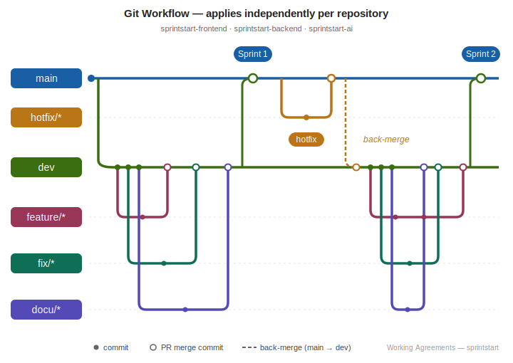

# Working Agreements

This document is the team's shared agreement on **how we work together** —
our Git workflow and how the [Definition of Done](./definition-of-done.md)
is enforced.

---

## 1. Git workflow

### 1.1 Branches

| Branch | Purpose | Protected? |
|---|---|---|
| `main` | Latest working release | Yes — no direct pushes |
| `dev` | Current sprint integration branch | Yes — no direct pushes |
| `<type>/<issue>-<short-name>` | One unit of work; `<type>` is `feature`, `fix`, or `docu` | No |
| `hotfix/<issue>-<short-name>` | Urgent fix to `main`; see § 1.6 | No |

Flow:

```
<type>/* ──► (PR) ──► dev ──► (PR, merge commit) ──► main
```

- Branch **from `dev`** for every new piece of work.
- Branch names: `<type>/<issue-number>-<short-name>` where `<type>` is
   - `feature` 
  - `fix`
   - `docu`

  *e.g.* `feature/42-onboarding-path-stub`,
  `docu/63-update-readme`.
- Exceptions that may target `main` directly: see Fast-Track (1.6).
- One sprint = one `dev → main` merge, executed as a **merge commit** so each
  sprint boundary is explicit in `main`'s history while the dev commits stay
  preserved.

  

### 1.2 Pull Requests

| Rule | Detail |
|---|---|
| **Reviewers** | At least 1 approving review from a non-author |
| **CI** | All required checks green (see [Definition of Done](./definition-of-done.md)) |
| **Linked issue** | PR description includes `Closes #<issue>` or `Refs #<issue>` |
| **Description** | Fill in the [DoD checklist](./definition-of-done.md) directly in the PR body |
| **Self-merge** | Allowed after approval + green CI |
| **Force pushes** | Disabled on `dev` / `main`; allowed on feature branches |

### 1.3 Commit messages

- Imperative mood: `add onboarding path generator`, not `added`.
- Reference the issue when relevant: `add onboarding path generator (#42)`.

### 1.4 Conflicts and rebases

- Prefer **rebase onto `dev`** to keep feature branches linear.
- If a conflict can't be resolved trivially, ask the conflicting change's
  author in the team channel before force-resolving.

### 1.5 Enforcement

- **GitHub branch protection** on `dev` and `main`: 1 review required, status
  checks required, no force-push, no direct push.
- **CI** runs on every PR.

---

### 1.6 Fast-Track to `main`

For trivial changes that do not affect product behavior, a PR may target
`main` directly, bypassing `dev`. 

**Examples:**
- Documentation, README
- Typo fixes in user-facing strings
- Tooling configs (e.g. .gitignore)
- CI workflow changes that don't alter required checks
- Reverts of broken merges


**Rules:**
- CI must pass (no exception)
- After merge to `main`, immediately back-merge `main → dev` to keep
  branches in sync.


### 1.7 Release freeze

The day before each Sprint Review (every second Tuesday, **06:00**) the sprint
goes into **release freeze**: no more feature merges into `dev`. The remaining
time is for **testing and integration**:

- Each repo does its `dev → main` merge.
- The three services (backend, frontend, AI) are run together and smoke-tested
  end to end. This step proves each
  service still talk to each other.
- After the merge, tag each repo's `main` with the sprint's release version —
  the **same tag in all three repos** (*e.g.* `v0.2.0`).

While the freeze is on, if you find a bug:

- **Non-critical?** Either open a GitHub issue for a later sprint, **or** fix it
  on a branch but **don't merge into the frozen branch** — it lands after the
  freeze lifts.
- **Release-blocking?** Fix it now with a minimal diff, 1 review, and green CI,
  then merge so the demo build is fixed.

The freeze lifts when the next sprint starts.


---


## 2. Quality enforcement

How the [Definition of Done](./definition-of-done.md) is verified —
automated where possible, manual where it must be judgmental.

| DoD requirement | Mechanism |
|---|---|
| Lint / tests / build / secret-scan | GitHub Actions required CI |
| One review approval | GitHub branch protection on `dev` and `main` |
| All boxes filled on the PR | PR template (Sprint 1+) + reviewer responsibility |
| Black-box test per functional requirement | Reviewer verifies during PR review |


---

